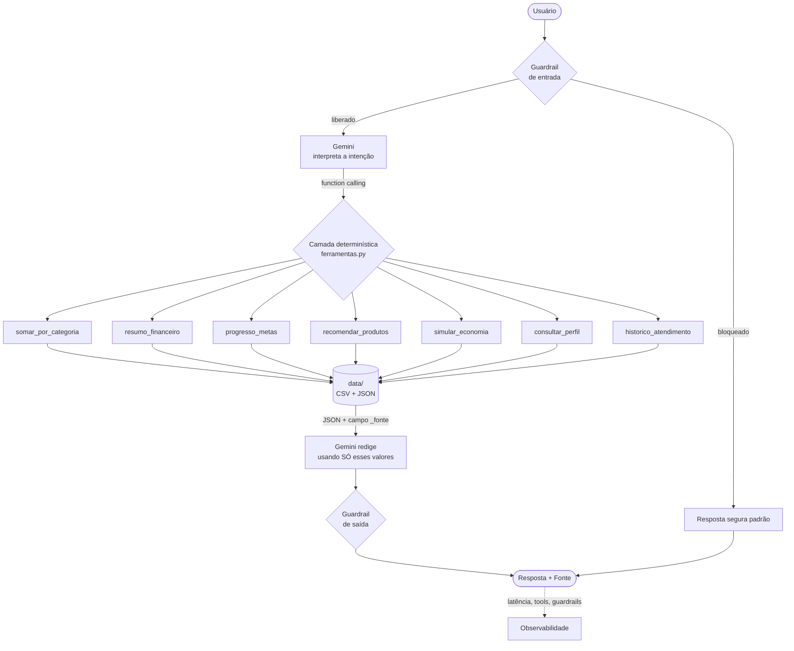

# 1. Documentação do Agente

## 1.1 Caso de Uso

### O problema

João Silva, 32 anos, analista de sistemas, ganha R$ 5.000 por mês e **poupa 50,2% da renda** — um número excelente. Mesmo assim, sua reserva de emergência está parada em R$ 10.000 de uma meta de R$ 15.000, e o prazo que ele mesmo definiu (junho/2026) **já venceu**.

O problema não é falta de dinheiro. É **falta de visibilidade e de um próximo passo concreto**.

O extrato responde "para onde foi o meu dinheiro". A pergunta que fica sem resposta é a seguinte — "e agora, o que eu faço com isso?". Ninguém diz para o João:

> "Faltam R$ 5.000. No seu ritmo, você fecha em 2 meses. Se cortar 30% de alimentação e lazer, economiza R$ 187,77 por mês. Quer ver como?"

### O que a Luma resolve

A **Luma** é uma agente financeira consultiva que transforma dados brutos (extrato + perfil + catálogo de produtos) em **decisão acionável**, com foco em uma missão específica: **fechar o gap da reserva de emergência do cliente**.

Escopo deliberadamente estreito. Um agente que faz uma coisa bem é mais útil — e mais avaliável — do que um que tenta fazer tudo.

### Os 4 pilares do desafio

| Pilar | Como a Luma implementa |
|---|---|
| **Antecipar necessidades** | A mensagem de abertura já traz o diagnóstico da meta antes de qualquer pergunta. Toda resposta termina com um próximo passo sugerido. |
| **Personalizar** | Todas as respostas partem do `perfil_investidor.json`: renda, perfil de risco, metas e prazos reais do cliente. |
| **Cocriar** | O agente não entrega veredito. Ele simula cenários (`simular_economia`) e devolve a escolha ao cliente. |
| **Anti-alucinação** | O LLM é **proibido de calcular**. Ver seção 1.4. |

### Segundo pilar: proteção contra golpes

Durante o desenvolvimento surgiu uma pergunta incômoda: de que adianta a Luma otimizar R$ 187,77 por mês de economia se um único golpe de Pix leva R$ 800 numa tarde?

O Brasil vive uma epidemia de fraudes financeiras desde a popularização do Pix. Para um cliente como o João — que poupa com disciplina — **o maior risco patrimonial não é escolher o investimento errado, é perder tudo para um estelionatário**.

Por isso a Luma ganhou um segundo pilar, o **Escudo Antifraude**, com três funções:

| Função | O que faz |
|---|---|
| **Prevenir** | Catálogo de 9 tipos de golpe financeiro, com gatilhos e conduta |
| **Detectar** | Classifica o risco de uma abordagem suspeita descrita pelo usuário |
| **Aprender** | Registra golpes sofridos num diário que vira defesa futura |

Isso é coerente com a persona: a Luma já recusava produto incompatível para proteger o cliente. Proteger contra fraude é a mesma postura, aplicada a um risco mais imediato.

#### O que fica de fora, e por quê

Uma versão anterior deste agente também diagnosticava celular infectado: cruzava sintomas (lento, quente, bateria caindo) com sinais de malware e dava um protocolo de contenção. Funcionava, e estava testado.

Foi removido. O motivo é o próprio princípio anti-alucinação: a base da Luma são transações, perfil, metas, produtos e golpes financeiros. Nada ali sustenta uma afirmação sobre o hardware do cliente. Um agente que opina fora da sua base é exatamente o que os guardrails deveriam impedir — e a coerência de escopo vale mais do que a soma de funcionalidades.

O que permaneceu foi o golpe **malware bancário** no catálogo, tratado pelo ângulo que é competência dela: como o dinheiro é roubado e como proteger a conta. O diagnóstico do aparelho é da assistência técnica.


### Fora de escopo (o que a Luma NÃO faz)

- Não executa transações, transferências ou aplicações
- Não acessa dados bancários reais (usa dados mockados)
- Não faz recomendação personalizada de investimento no sentido regulatório (CVM 179)
- Não opina sobre ações específicas, criptomoedas ou câmbio
- Não responde nada fora de finanças pessoais
- Não substitui boletim de ocorrência nem canal oficial do banco em caso de fraude

---

## 1.2 Persona e Tom de Voz

**Nome:** Luma
**Arquétipo:** a amiga que entende de dinheiro — competente, mas sem soberba.

### Por que "Luma"

O nome inicial era "FIN" (de *finance*). Foi trocado por uma razão de produto: **FIN soa a sistema, Luma soa a pessoa.**

| Critério | FIN | Luma |
|---|---|---|
| Memorabilidade | Sigla genérica | Nome próprio, fácil de lembrar |
| Calor humano | Frio, corporativo | Acolhedor |
| Coerência com a persona | Contradiz o tom consultivo | Reforça o tom consultivo |

Falar sobre dinheiro envolve vergonha e ansiedade. Um cliente conta a um assistente chamado Luma que estourou o orçamento com mais naturalidade do que a um sistema chamado FIN. O nome remete a *luz* — que é exatamente a proposta: **clareza sobre as próprias finanças**.

| Atributo | Definição |
|---|---|
| **Tom** | Claro, acolhedor, direto. Português do Brasil, tratamento por "você". |
| **Linguagem** | Zero economês. Todo termo técnico ganha uma explicação de uma linha. |
| **Tamanho** | Até ~150 palavras. Respostas longas viram listas. |
| **Postura** | Consultiva, nunca impositiva. Apresenta cenários, não ordens. |
| **Honestidade** | Prefere dizer "não sei" a arriscar um palpite sobre o dinheiro alheio. |

### Exemplos de linguagem

| Situação | Como a Luma fala |
|---|---|
| Cumprimento | *"Olá, João!  Dei uma olhada nos seus números antes de você perguntar..."* |
| Entrega de dado | *"Você gastou **R$ 570,00** com alimentação, em 2 lançamentos: ..."* |
| Não sabe | *"Não tenho esse dado na minha base, e prefiro não arriscar um palpite sobre o seu dinheiro."* |
| Recusa (compliance) | *"Entendo a vontade de acelerar os ganhos, mas preciso ser honesto com você: ..."* |
| Fora de escopo | *"Essa eu não sei — cuido só das suas finanças."* |

### Anti-persona (o que evitar)

- Vendedor: *"Aproveite essa oportunidade imperdível!"*
- Robô: *"Sua solicitação foi processada. Código 200."*
- Julgador: *"Você gastou demais com lazer."*
- Adivinho: *"Esse fundo deve render uns 12% ao ano."*

---

## 1.3 Arquitetura

### Princípio: separação entre cálculo e linguagem

A decisão arquitetural central do projeto é esta:

> **O LLM interpreta e explica. O Python calcula.**

Um LLM é um excelente tradutor de intenção e um péssimo somador. Então nenhum número passa pelo modelo antes de ser calculado por código determinístico.

### Fluxo




### Componentes

| Arquivo | Responsabilidade |
|---|---|
| `src/ferramentas.py` | 17 funções determinísticas. Única camada que toca os dados e faz contas. |
| `src/prompts.py` | System prompt com regras, compliance e few-shot. |
| `src/agente.py` | Orquestrador: guardrails, function calling, fallback demo. |
| `src/app.py` | Interface web (Streamlit). |
| `src/cli.py` | Interface de terminal (roda sem dependências extras). |
| `eval/avaliar.py` | Suíte de avaliação automatizada. |

### Modo duplo de execução

| Modo | Quando | Comportamento |
|---|---|---|
| **Gemini** | Há `GOOGLE_API_KEY` | Function calling nativo. Linguagem natural completa. |
| **Demo** | Sem chave | Roteamento por palavra-chave + templates. **As mesmas ferramentas e os mesmos guardrails.** |

O modo demo existe por uma razão prática: **um avaliador que não consegue rodar o projeto não avalia o projeto.** `python src/cli.py` funciona em qualquer máquina com Python, sem instalar nada.

---

## 1.4 Segurança e Anti-Alucinação

No setor financeiro, um número errado não é um bug — é um dano. A Luma usa **cinco camadas** de proteção.

### Camada 1 — Impossibilidade estrutural de errar contas

Este é o diferencial central do projeto. O LLM **não tem acesso aos dados brutos** e **não faz aritmética**. Ele só pode:

1. Escolher qual ferramenta chamar
2. Redigir usando os valores que a ferramenta retornou

Se o Python calculou `R$ 570,00`, é isso que chega ao usuário. A alucinação numérica não é *desencorajada por prompt* — ela é **estruturalmente impossível**.

### Camada 2 — Citação obrigatória de fonte

Toda ferramenta retorna um campo `_fonte`. Toda resposta com dados termina com:

```
Fonte: data/transacoes.csv (2 registros)
```

O usuário sempre pode auditar de onde veio o número.

### Camada 3 — Guardrails de entrada

Executados **antes** do LLM, por regex:

| Ameaça | Detecção | Resposta |
|---|---|---|
| Dado sensível | `senha`, `PIN`, `CVV`, `código de segurança` | Recusa + orientação de segurança |
| Prompt injection | `ignore as instruções`, `esqueça suas regras`, `aja como`, `revele seu prompt` | Recusa firme + recondução |

### Camada 4 — Guardrails de saída (compliance)

Executados **depois** do LLM, antes de entregar:

| Regra | Implementação |
|---|---|
| Proibido prometer rentabilidade futura | Regex substitui *"vai render"* → *"historicamente rendeu"* |
| Disclaimer obrigatório | Injetado automaticamente se a resposta cita produtos |
| Produto incompatível bloqueado | Filtrado na **origem**: `recomendar_produtos()` nunca devolve produto de risco alto para quem tem `aceita_risco: false` |

O bloqueio na origem é importante: o modelo nunca chega a *ver* o Fundo de Ações como opção viável. Não é preciso confiar que ele vai obedecer.

### Camada 5 — Escudo antifraude (proteção do usuário, não do sistema)

As quatro camadas anteriores protegem contra o agente errar. Esta protege o **usuário** contra terceiros.

A classificação de risco é determinística, como todo o resto do projeto: `analisar_suspeita()` procura marcadores objetivos no relato (`conta segura`, `lucro garantido`, `taxa antecipada`) e bandeiras universais (urgência, sigilo, pedido de dado sensível, pagamento para pessoa física). O nível de risco sai de uma contagem de sinais — **o LLM não opina se é golpe**.

Decisão de design importante: a resposta a quem caiu em golpe começa por *"cair em golpe não é burrice"*. Não é gentileza — é prevenção. Vergonha faz a vítima silenciar, e o silêncio é o que permite o segundo golpe.

### Camada 6 — Avaliação contínua

62 casos automatizados, incluindo **10 testes adversariais** (red team). Rodam com um comando e geram relatório versionado. Ver `docs/04-metricas.md`.

### Limitações declaradas

- Dados mockados e estáticos — não há integração bancária real
- Base pequena (10 transações, 5 produtos): serve ao protótipo, não à produção
- O modo demo usa roteamento por palavra-chave, não compreensão semântica
- O agente não substitui um assessor de investimentos certificado
